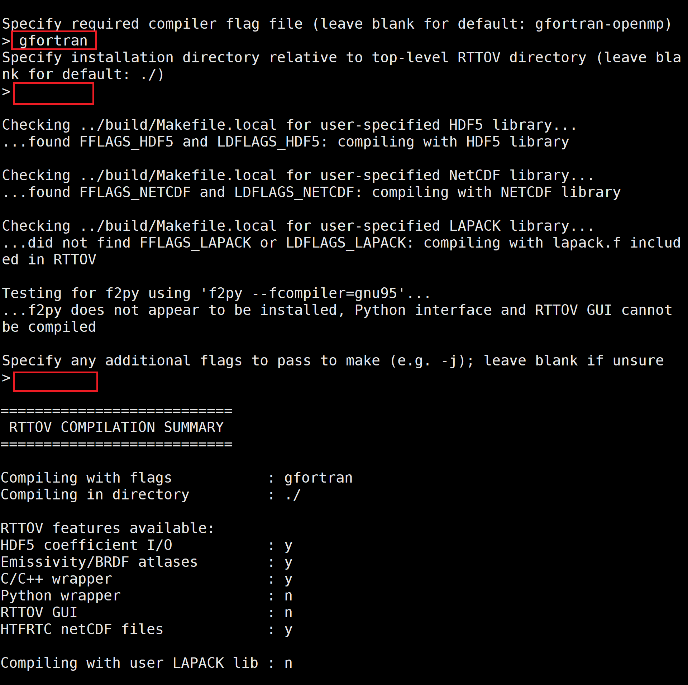
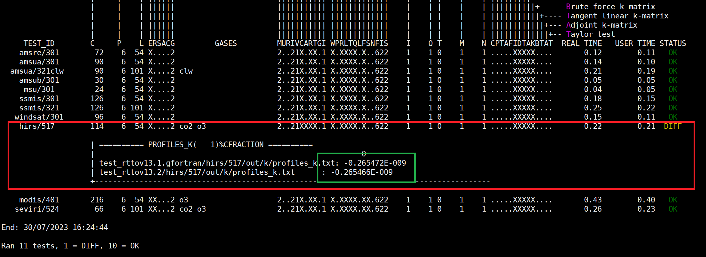
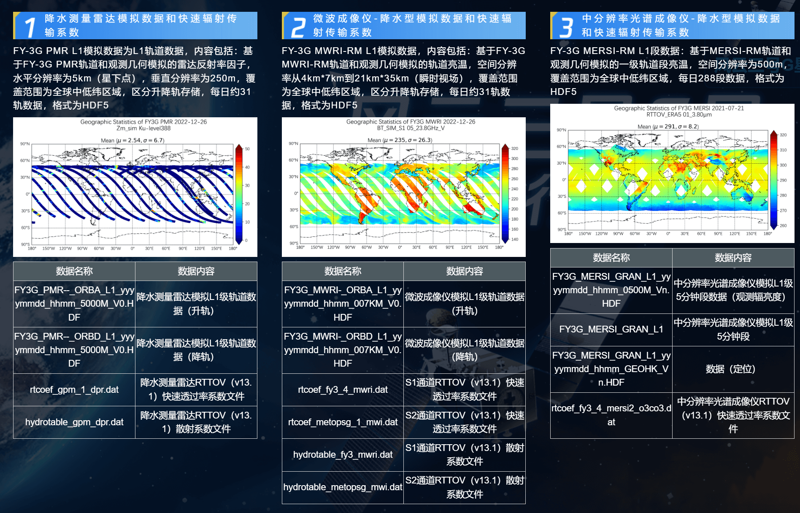

# RTTOV模式笔记：(二) RTTOV V13.2安装

&copy;Jiheng Hu 2023-2030, 禁止转载。


在上一节中，我们已经完成了对依赖库的安装，本节将对RTTOV进行安装。

## RTTOV 13.2 安装RTTOV
1. 去官网下载RTTOV13.2 安装包： rttov132.tar.xz
```bash
$ mkdir rttov13
$ tar xvf rttov132.tar.xz -C rttov13/
$ cd rttov13
```

2. 修改build/Makefile.local，指明HDF和NC库的位置，以及编译参数。
```makefile
HDF5_PREFIX  = /home/hjh/hdf5

# For most compilers:
FFLAGS_HDF5  = -D_RTTOV_HDF $(FFLAG_MOD)$(HDF5_PREFIX)/include

# But you may find that you must also specify libz:
# (NB for NAG Fortran you may also need to add -ldl)
LDFLAGS_HDF5 = -L$(HDF5_PREFIX)/lib -lhdf5hl_fortran -lhdf5_hl -lhdf5_fortran -lhdf5 -lz

NETCDF_PREFIX  = /home/hjh/netcdf
# For most compilers:
FFLAGS_NETCDF  = -D_RTTOV_NETCDF -I$(NETCDF_PREFIX)/include

# For NetCDF v4.2 and later:
LDFLAGS_NETCDF = -L$(NETCDF_PREFIX)/lib -lnetcdff
```
3. 编译RTTOV
```bash
$ cd src
$ ../build/rttov_compile.sh
```
编译器选择gfortran, 脚本会自动检测上述的NC和hdf库的配置，这里由于不需要安装UI界面，所以不用安装f2py。
```
Specify required compiler flag file (leave blank for default: gfortran-openmp)
> gfortran
Specify installation directory relative to top-level RTTOV directory (leave blank for default: ./)
> [回车]
......
- Are you sure to compile RTTOV [yes/no]?
> yes
...漫长的编译...
RTTOV compiled successfully
```
 

4. 测试RTTOV
```bash
$ cd rttov_test
$ ./test_rttov13.sh ARCH=gfortran
```
本次安装测试结果：
 
可以看出，除了HIRS这台载荷的参数有细微差异外，对于其他仪器的测试都通过了。这个报错可能是由于版本和库版本的差异导致，非常微小。由于我不使用HIRS这台仪器，这样的差异是可以接受的。


## RT coefficients 下载 
1. 下载
细心的会发现，rtcoef_rttov13/路径下的每个文件夹都是空的，这里需要根据需要下载RTTOV的大气吸收和散射系数。
这些系数按照模式方案和卫星，仪器，通道来存储。
官网提供了下载脚本：https://nwp-saf.eumetsat.int/site/software/rttov/download/coefficients/coefficient-download/ 
> The `rttov_coef_download.sh` script supplied in the RTTOV package in the `rtcoef_rttov13/` directory can be used for downloading coefficient files in bulk or you can download individual files from the links below.  
   
说的很清楚了，这里直接下载全部，也可以根据需要去上述页面选择下载。下载脚本支持指定文件下载。
note: 服务器需要联外网，脚本会下载和解压相应的文件。
这里我只需要微波相关的系数数据，包括大气混合气体，水汽和水凝物是系数廓线。
```cmd
[hjh@node05] ~/rttov13 $ cd rtcoef_rttov13/
[hjh@node05] ~/rttov13/rtcoef_rttov13 $ ./rttov_coef_download.sh 
=========================================================================
 RTTOV coefficient download script
=========================================================================
File types are:
  - Optical depth (rtcoef) coefficient files for MW, IR and VIS/IR
  - VIS/IR aerosol (scaer) and cloud (sccld) coefficient files
  - MFASIS LUT files
  - MFASIS NN files
  - RTTOV-SCATT MW hydrotable files
  - Optical depth (rtcoef) files for hi-res IR sounders
  - Hi-res IR sounder aerosol (scaer) and cloud (sccld) coefficient files
  - PC-RTTOV coefficient files
  - HTFRTC coefficient files in netCDF format
  - HTFRTC coefficient files in ASCII format
=========================================================================
Download all files (y) or specify files to download (n)? 
> n
Download VIS/IR/MW rtcoef files? (y/n) 
> y
Download VIS/IR cld/aer coef files? (y/n) 
> y
......
Download MW hydrotable files? (y/n) 
> y
......
==============================================================================
Downloading files with extension .tar.bz2 from https://nwp-saf.eumetsat.int/downloads/rtcoef_rttov13/rttov13pred101L
......
```

大气消光和散射系数是按照模式方案和卫星、仪器来存储的。如`rtcoef_rttov13/rttov13pred54L/`的部分文件：  

```
rtcoef_gpm_1_dpr.dat 	 	## DPR
rtcoef_gpm_1_gmi.dat　		## GMI  
rtcoef_fy3_2_mwri.dat 		## FY3B MWRI
rtcoef_fy3_3_mwri.dat 		## FY3C MWRI
rtcoef_fy3_4_mwri.dat 		## FY3D MWRI
rtcoef_fy3_5_mwhs2e_srf.dat ## FY3E MWHS
rtcoef_fy3_5_mwts3_srf.dat  ## FY3E MWTS
```

最新的FY3G MWRI和PMR,MERSI应用先行研究使用的系数表见[风云三号星G星应用先行数据集主页](http://satellite.nsmc.org.cn/FY3G/html/APPDATASET.html)。3G星的参数官方还在制作中，可能24年发布，目前使用的参数来自3D星的参数表。

2. 特性介绍
- New hydrotables for RTTOV v13-水凝物计算
考虑了5种水凝物的光学性质:雨、雪、霰、云液态水、云冰水。在代码中，必须按照相同的顺序在输入`cld_profiles(1:nprofiles)%hydro(1:nlevels,1:nhydro)`数组中提供含水量浓度，其中默认表的nhydro=5。您可以使用不同数量的粒子类型(nhydro)生成自己的hydrotable。

5种水凝物采用的光学方案和粒径谱：
- `rain`: Mie sphere, Marshall-Palmer size distribution (unchanged since latest v12 Mietables)

- `snow`: ARTS large plate aggregate, Field07 tropical size distribution (updated for v13) 

- `graupel`: ARTS column, Field07 tropical size distribution (new in v13) 

- `cloud liquid`: Mie sphere, Gamma size distribution implemented within the new modified gamma framework (mostly unchanged in terms of optical properties, but with small differences from the previous gamma distribution, which was implemented internally using some scientific shortcuts)

- `cloud ice`: ARTS large column aggregate, Gamma PSD with generalised modified gamma parameters mu = 0, lambda = 1e4, gamma = 1 and N0 free (updated for v13)

	这里提到的generalised modified PSD的形式为：

	$$
	N(D)=N_0 D^\mu e^{-\lambda D}   ;  \mu=0时退化成指数函数
	$$

	>Geer A. J., Bauer B., Lonitz K., Barlakas V., Eriksson P., Mendrok J., Doherty A., Hocking J., and Chambon P. 2021: Bulk hydrometeor optical properties for microwave and sub-millimetre radiative transfer in RTTOV-SCATT v13.0. Geosci. Model Dev., 14, 7497-7526, https://doi.org/10.5194/gmd-14-7497-2021

- MW optical depth coefs and RTTOV-SCATT optical properties  
	General information on MW sensor optical depth coefficient files:
	- Based on Liebe 89/92 LbL model
	- All on 54 levels
	- v13 predictors
	- No Planck-weighted channels
	- No optional trace gases except for sensors with channels above 200GHz which enable variable O3


## Surface Emissivity Atlas Data
由于进行微波辐射传输模拟需要地表微波比辐射率作为输入量，去官网下载：[Emissivity_BRDF_atlas_data](https://nwp-saf.eumetsat.int/site/software/rttov/download/#Emissivity_BRDF_atlas_data)
BRDF是对短波段而言的地表双向反射率，需要的话可以自己下载，这里微波不需要。
一般，Emissivity atlas作为先验的地表输入，在变分反演模式中会不停的调整迭代，直到达到多变量的物理一致性和收敛到代价函数的最小值。
在变分算法中，基于前人研究的emissivity先验证的初始猜测可以显著减小迭代次数和计算量。
一般常用telsem2_mw_atlas (F. Aires, 2001)
当然了，可选还有很多，除了官网推荐的，还有 (Munchak,2020; Nourizi, 2011; Moncet, 2011; Hu, 2020) 等。

## 参考
[RT Coefficients 下载](https://nwp-saf.eumetsat.int/site/software/rttov/download/coefficients/coefficient-download/)
[Emissivity Atlas 下载](https://nwp-saf.eumetsat.int/site/software/rttov/download/emissivity-data/)