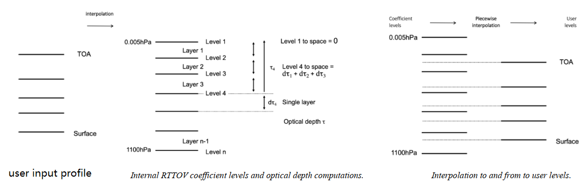

# RTTOV模式笔记：(三) 一些约定和特性

&copy;Jiheng Hu 2023-2030, 禁止转载。

本节介绍的内容来自RTTOV v13文档，包括[《RTTOV v13 Quick Start Guide》](./filzoo/rttov-quick-start.pdf)和[《RTTOV v13 Users Guide v13》](./filzoo/users_guide_rttov13_v1.2.pdf)
这两个文档有很大部分重叠，基本上后者全面覆盖前者，本文不会对这两个文档细致分析，只摘录下最重要的部分列举。

## 光学参数设定
- RTTOV对于晴空模拟辐射光学厚度参数来自于事先计算好的消光系数，这些消光系数依赖于不同的仪器和气体成分。微波段的模拟不考虑除水汽之外的任何痕量气体，但是有些仪器会考虑O3，如MetopSG ICI。

- RTTOV提供的所有的光学厚度参数都是按照固定的层来提供的，对于大部分的仪器来说，系数都是标准的54层。此外，对于高光谱sounder仪器是101层。
54层的大气廓线分层为：
Pressure (hPa) 	0.01,	0.01,	0.03,	0.06,	0.13,	0.23,	0.41,	0.67,	1.08,	1.67,	2.5,	3.65,	5.19,	7.22,	9.84,	13.17,	17.33,	22.46,	28.69,	36.17,	45.04,	55.44,	67.51,	81.37,	97.15,	114.94,	134.83,	156.88,	181.14,	207.61,	236.28,	267.1, 300, 334.86,	371.55,	409.89,	449.67,	490.65,	532.58,	575.15,	618.07,	661,	703.59,	745.48,	786.33,	825.75,	863.4,	898.93,	931.99,	962.26,	989.45,	1013.29, 1033.54, 1050

- 内部插值：用户可以提供任意的层数的大气廓线，但是必须打开插值选项`opts%interpolation%addinterp=true`，以使得RTTOV内部进行插值。
插值的流程为: `1. RTTOV将用户输入的廓线插值到标准系数层`-> `2. 在标准系数层上计算光学厚度` -> `3. 将标准系数层的光学厚度插值回到用户输入的廓线层上，进行辐射传输计算`。

所以你会发现源码中有很多注释说明步骤执行是在user level上实现的。这个level指的是垂直分层，而不是后端开发里面的用户层、数据层、应用层啥的。。。

## 卫星和仪器ID

- 部分ID对应的卫星举例

|Platform|RTTOV ID|Sat ID range|注释|
|-|-|-|-|
| DMSP | 2 | 8 - 19 | F8-F19 |
| FY3  | 23 | 1 - 4 | FY3A-FY3D |
| Himawari |  31 | 8 - 9| H8,H9 |
| GPM | 37 | 1 | GPM-Core observatory |
| FY4| 52 | 1 | FY-4A |
| Sentinel3 | 19| 1 - 2 | Sentinel-3A, Sentinel-3B |

- 部分代码对应的仪器举例（微波）
  
|Sensor| RTTOV ID |Sensor Chans| 
|-|-|-|
|TMI| 9| 1-9| 
|AMSR-E| 17| 1-12|  
|MWRI| 43| 1-10| 
|AMSR2| 63| 1-14|
|GMI| 71| 1-13| 
|MWI| 79| 1-26|  

持续更新中...
