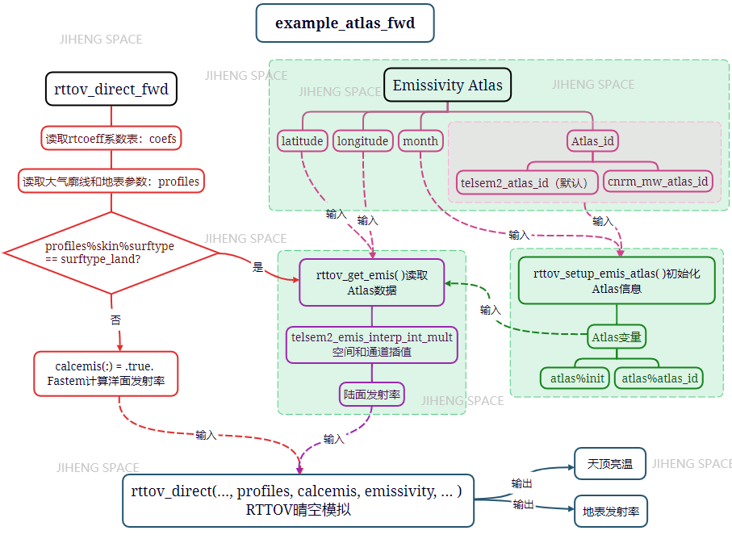
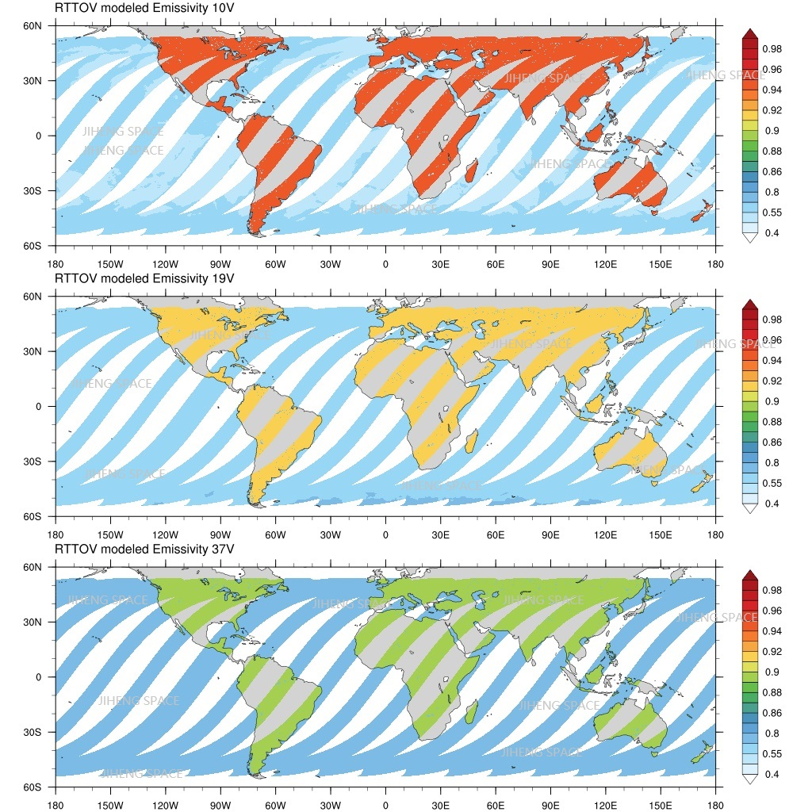
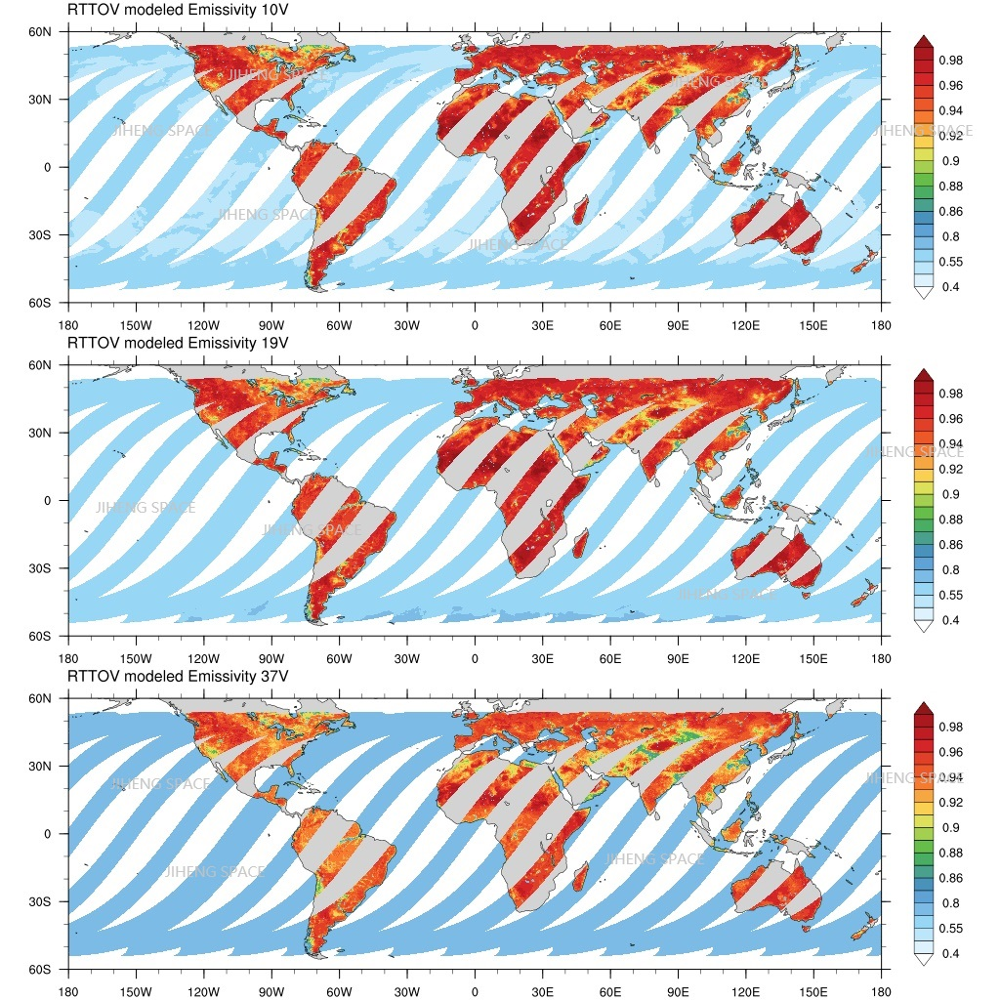
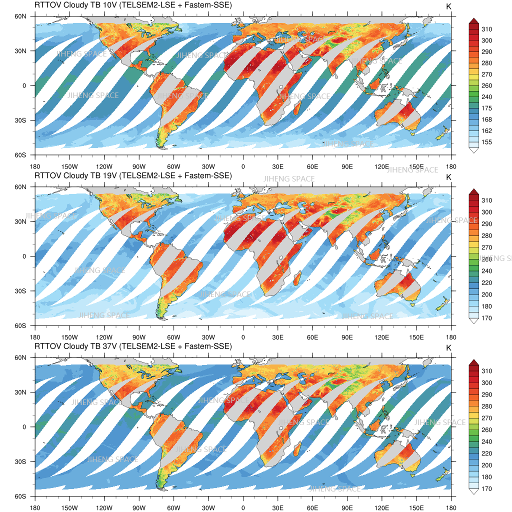

# RTTOV模式笔记：(五) 基于Direct Forward的晴空模拟

&copy;Jiheng Hu 2023-2030, 禁止转载。

## 晴空模拟流程

- example_fwd例程
[`/src/test/example_fwd.F90`](./filzoo/example_fwd.F90)展示了对最通用简单的RTTOV晴空模拟案例，你只需要根据需求修改自己模拟输入即可。
RTTOV模拟通常包含以下步骤，这也是本例程的结构。
>   The usual steps to take when running RTTOV are as follows:

    1. Specify required RTTOV options
	
    2. Read coefficients
	
    3. Allocate RTTOV input and output structures
	
    4. Set up the chanprof array with the channels/profiles to simulate
	
    5. Read input profile(s)
	
    6. Set up surface emissivity and/or reflectance
	
    7. Call rttov_direct and store results
	
    8. Deallocate all structures and arrays
	

rttov coefficient输入字符串地址，例如可以输入54层FY3D MWRI应用先行数据集提供的coefficient参数表：
[`/home/hjh/rttov13/rtcoef_rttov13/rttov13pred54L/rtcoef_fy3_4_mwri.dat`](./filzoo/rtcoef_fy3_4_mwri.dat)。
rttov profile 输入，例程是按照格式化方式读入的，示例的廓线为:
[`/home/hjh/rttov13/rttov_test/test_example.1/prof.dat`](./filzoo/prof.dat)。

- 跳过文件中的注释行：CALL rttov_skipcommentline(iup, errorstatus)

- 指定气体的单位:
	```fortran
	! 0 => ppmv over dry air
	! 1 => kg/kg over moist air
	! 2 => ppmv over moist air
	READ(iup,*) profiles(1) % gas_units
	profiles(:) % gas_units = profiles(1) % gas_units 
	```
	如果使用ERA5的水汽混合比Q，其单位是kg/kg，应当gas_units=1；
	
- 随后依次是Pressure levels (hPa)Temperature profile (K)Water vapour profile (ppmv)的自上而下的51层廓线，Ozone profile (ppmv)的轮廓线没有考虑，在源码和廓线示例中都被注释了

- 最下面是近地表和surface的参数，仪器参数，分别被读进profiles(iprof)%s2m； profiles(iprof)%skin； profiles(iprof)%elevation等结构中；

- 这里还有一个simple cloud 参数，对于晴空，将cloud fraction设为0.0就可以忽略云的考虑：
```f90
! Cloud top pressure (hPa) and cloud fraction for simple cloud scheme
   500.00    0.0
```

## 个例实战(一) 理想晴空单柱正向模拟
设定：
1. 使用参考大气廓线；
2. 使用理想的地表发射率
3. 只考虑水汽的吸收，不考虑O3、云等水凝物的吸收和散射

输入的设置如下：

```fortran example_fwd.F90
  !========== Interactive inputs == start ==============
  ! coeff 文件
  coef_filename='/home/hjh/rttov13/rtcoef_rttov13/rttov13pred54L/rtcoef_fy3_4_mwri.dat'
  prof_filename='./prof.dat' ! 理想廓线
  nprof=1   ! 单柱模拟
  nlevels=51 
  dosolar=0  ! 不考虑日光
  nchannels=10 ! 10个通道
  channel_list=(/1,2,3,4,5,6,7,8,9,10/)  ! 通道列表
  nthreads=1  ! 单线程
```
``` bash
$ make -f Makefile_examples # 编译
$ ./example_fwd.exe ## 执行
	path of coefficient file   --------------  
        /home/hjh/rttov13/rtcoef_rttov13/rttov13pred54L/rtcoef_fy3_4_mwri.dat                                                                                                                                                                                       
	path of file containing profile data ------------ ./prof.dat                                                                                                                                                                                                                                                      
	number of profiles ---------------           1
	number of profile levels -------------          51
	turn on solar simulations? (0=no, 1=yes)  --------       0
	number of channels to simulate per profile -----------      10
	enter space-separated channel list ---------------
	 1    2    3    4    5    6    7    8     9    10
	number of threads to use  --------------------       1
```
### 洋面模拟结果
这里是洋面的模拟结果（Surface type=1）:
```
 CALCULATED BRIGHTNESS TEMPERATURES (K):
   114.68  114.71  133.38  133.23  159.48  159.25  158.36  157.81  215.07  213.82
  
 CALCULATED SURFACE TO SPACE TRANSMITTANCE:
   0.9867  0.9867  0.9530  0.9530  0.8799  0.8799  0.9214  0.9214  0.7887  0.7887
  
 CALCULATED SURFACE EMISSIVITIES:
    0.379   0.379   0.408   0.407   0.427   0.426   0.472   0.470   0.606   0.599
```
这里可以看出，洋面的模拟emissivity在0.5以下，这是一个非常典型的洋面发射率值，并且随着频率升高，这是由Debye方程决定的，并且由于洋面的spacular特性，发射率存在极化差。
在如此低的背景输出情况下，模拟得到的天顶亮温在200K以下，对于晴空洋面，也较为合理。如果这时候出现云（240K以上），那么对比度会非常高，所以洋面云和降水反演算法的精度较高。
> 关于表面发射率的模拟
洋面的发射率模拟会考虑海温、盐度、洋面风速等物理量。一般来说，先计算海水的节点常数，随后进行Fresnel反射率计算，最后还要进行风速作用下的表面粗糙洋面的反射率修正。这个思想和陆面发射率模拟的思想是相通的，只不过陆面考虑的介质更复杂，表面的粗糙和风速也无关。所以，整个RTTOV模式只考虑了近地面风场，并且只有在进行洋面发射率模拟时才用到，在进行发射率反演及陆面模拟时，风速的输入是可选的。

### 陆面模拟结果
我们修改一下Surface type=0,可以进行陆面上空的辐射传输模拟。
输出结果如下：
```
 CALCULATED BRIGHTNESS TEMPERATURES (K):
   256.79  256.79  253.56  253.56  256.05  256.05  252.24  252.24  261.27  261.27
  
 CALCULATED SURFACE TO SPACE TRANSMITTANCE:
   0.9867  0.9867  0.9530  0.9530  0.8799  0.8799  0.9214  0.9214  0.7887  0.7887
  
 CALCULATED SURFACE EMISSIVITIES:
    0.893   0.893   0.875   0.875   0.869   0.869   0.864   0.864   0.874   0.874
```
可以看出，RTTOV的MEM模块算出来的陆面emissivity在0.9左右，相应的TB模拟在250K以上，这个结果对于陆面理想模拟来说，较为合理。

### 自定义Emissivity
除了把Emissivity交给表面模块来计算，我们还可以手动设定输入，以服务于敏感性研究或变分反演方法：
```fortran
...... 
  ! --------------------------------------------------------------------------
  ! 6. Specify surface emissivity and reflectance
  ! --------------------------------------------------------------------------
.......
  ! Calculate emissivity within RTTOV where the input emissivity value is
  ! zero or less (all channels in this case)
  ! 不进行地表发射率计算
  calcemis(:) = .false.
  ! calcemis(:) = (emissivity(:) % emis_in <= 0._jprb)
  ! 为所有通道指定0.9的发射率
  emissivity(:) % emis_in=0.9
```
输出的亮温模拟结果如下：
```
 CALCULATED BRIGHTNESS TEMPERATURES (K):
   258.71  258.71  260.13  260.13  262.91  262.91  261.00  261.00  265.89  265.89
  
 CALCULATED SURFACE TO SPACE TRANSMITTANCE:
   0.9867  0.9867  0.9530  0.9530  0.8799  0.8799  0.9214  0.9214  0.7887  0.7887
  
 CALCULATED SURFACE EMISSIVITIES:
    0.900   0.900   0.900   0.900   0.900   0.900   0.900   0.900   0.900   0.900
```
这里可以看出，天顶亮温模拟的极化差为0，这是因为手动设定的Emissivity忽略了地表几何特征引起的反射率的极化差。而大气辐射传输则不会考虑偏振差异，因此有这样的结果；

除了以上方法，发射率还可以使用Emissivity Atlas作为输入，这个前面讲过，后面用到了会做相应介绍。
> 注意到上述三种情形：洋面、陆面和手动陆面情形下的大气透过率是一样的，也就是说，大气的辐射传输贡献和地表本身的辐射背景输入无关，基于这一原理，我们可以实现自上而下的反演计算。
辐射传输模式也表明了这一点：

$$
Tb_{v,p}=T_u+Γ_v [e_{v,p} T_s+(1-e_{v,p}) T_d]
\\\\
e_{v,p}=(Tb_{v,p} - T_u - \tau_v T_d)/(τ_v (T_s-T_d))
$$


## 个例实战(二) 晴空轨道模拟
本个例将使用再分析资料进行2023.06.27日的FY上行轨道进行模拟, 模拟卫星观测到的轨道天顶亮温
### 试验设置
使用ERA5相关资料为RTTOV提供输入量，并使用风云的轨道经纬度信息模拟出卫星的实时观测。模拟设定如下：
1. 不涉及像斑卷积和频率运算；
2. 不考虑积雪、海冰和云的存在；
3. 采用最邻近匹配廓线和地表近地表参数；
4. 廓线取50GHz以下诸层，共29层；
5. 2m比湿取廓线最底层的值；
6. 洋面发射率和地表发射率交给模式模拟；
7. 逐轨道模拟。

### 主要步骤：
- 读取卫星Swath的观测几何参数
```fortran
	call read_FY_Vars(FY_FILENAME,nscan,npix,FYlon,FYlat,FYtbs,minsec,igbp,lsmask,dem,retcode)
	call read_FY_Geometry(FY_FILENAME,nscan,npix,sea,sez,soa,soz,retcode)
```
- 匹配和下载ERA5资料
```fortran
  call system("python3 "//trim(adjustl(pwd))//"ERA5/era5-pl-download.py "//yyyymmdd//" "//UTC_str )	
  call system("python3 "//trim(adjustl(pwd))//"ERA5/era5-land-download.py "//yyyymmdd//" "//UTC_str )	
  call system("python3 "//trim(adjustl(pwd))//"ERA5/era5-single-download.py "//yyyymmdd//" "//UTC_str )	
```
- 读取ERA5参数
```fortran
	call read_ERA5_profs(req_era5,lon,lat,qw,rh,ta,zg)
	call read_ERA5_surfs(req_surf,lst,psrf,t2m)        !! K, hPa, K     !!  1 (top) -> 29 (bottom)
	call read_ERA5_sigls(req_sigl,sst,psrf,t2m,u10,v10)
```
- 调用RTTOV 
```fortran
	call rttov_clearsky_fwd(npix,FYlon,FYlat,plevel,&
				 qw,ta,skt,psrf,t2m,u10,v10,dem,lsmask,sea,sez,soa,soz,simu) 
```
- 写出亮温模拟
```fortran
	call write_hdf5_var(fileout,nscan,npix,nchn,simu,FYlon,FYlat,retcode)
```

### 编译运行
连接网络（服务器环境）
```bash
$wlt>wlt.log
  --2023-08-16 16:52:18--  http://wlt.ustc.edu.cn/cgi-bin/ip
  正在解析主机 wlt.ustc.edu.cn (wlt.ustc.edu.cn)... 202.38.64.59
  正在连接 wlt.ustc.edu.cn (wlt.ustc.edu.cn)|202.38.64.59|:80... 已连接。
  已发出 HTTP 请求，正在等待回应... 200 OK
  长度： 未指定 [text/html]
  正在保存至: “STDOUT”
  -   [ <=>                   ]   4.74K  --.-KB/s    用时 0s    
  2023-08-16 16:52:18 (18.8 MB/s) - 已写入标准输出 [4858]
```
编译。这里可能会出现一类似`The following floating-point exceptions are signalling: IEEE_UNDERFLOW_FLAG`和`stack overflow`的报错或warning，你可以适当使用`-mcmodel=large`、`-ffpe-summary=none`的编译选项来解决问题。
```bash
$sh bash.sh 
$tree
.
├── bash.sh                     ## 编译脚本
├── ERA5                        ## 存放下载的ERA5文件目录
│   ├── 20230626
│   ├── era5-land-download.py      ## 下载脚本
│   ├── era5-pl-download.py
│   └── era5-single-download.py
├── fyxx_mwri_fwd_clear.f90        ## main prgram
├── fyxx_mwri_fwd_clear.o          ## 编译生成的动态库
├── fyxx_mwri_fwd_clear_swath.exe  ## 编译生成的可执行文件
├── output                         ## 模拟输出文件夹
├── rttov_clearsky_fwd.f90         ## RTTOV调用接口
├── rttov_clearsky_fwd.o           ## RTTOV调用接口的动态库
├── subs                           ## 读写子程序NETCDF, HDF5
│   ├── read_ERA5_vars.f90
│   ├── read_FY_vars.f90
│   └── write_hdf5_var.f90
└── wlt.log                        ## 网络日志
```
运行。运行的时候可能会出现大量的limits超出的判断，可以再源码中使用`opts%config%apply_reg_limits= .false.`来禁用这些廓线和地表参数的检查。
```bash
$./fyxx_mwri_fwd_clear_swath.exe 20230627
 ├──Start proc. - /data04/0/MWRI/FYxx_IOT/ASCEND/20230627/FYxx_MWRI-_ORBA_L1_20230627_0048_7000M_V0.HDF
 │	├── FYxx vars read done!   
 │	├──  ERA5 file Not Found, calling Python downloading script
download- ERA5 20230626  UTC:  01
2023-08-16 16:52:52,406 INFO Welcome to the CDS
2023-08-16 16:52:52,407 INFO Sending request to https://cds.climate.coperni........e-levels
2023-08-16 16:52:52,920 INFO Request is queued
2023-08-16 16:52:55,960 INFO Request is running
2023-08-16 16:53:15,341 INFO Request is completed
2023-08-16 16:53:15,341 INFO Downloading https://download-0010-clon.....65.nc to ERA5/20230626/xxxxx-xxx-20230626-0100.nc (373.5M)
2023-08-16 16:55:30,643 INFO Download rate 2.8M/s 
 │	├── ERA5 vars read done!  
 │	├── Start RTTOV simulations
 │	└── Write down: output/RTTOV_CLEAR_SIMU_Swath_FYxx_MWRI-_ORBA_L1_20230627_0048_7000M_V0.HDF
 ├──Start proc. - /data04/0/MWRI/FYxx_IOT/ASCEND/20230627/FYxx_MWRI-_ORBA_L1_20230627_0221_7000M_V0.HDF
 .......
 │	└── Write down: output/RTTOV_CLEAR_SIMU_Swath_FYxx_MWRI-_ORBA_L1_20230627_2357_7000M_V0.HDF
 └── 20230627: process done
```
程序会自动根据需要下载ERA5文件。
```bash
$tree
.
├── ERA5
│   └── 20230627
│      └── ERA5-xxx-xxx-20230627-0100.nc      ## 自动下载的ERA5
├── FY_filelist_20230627.txt                  ## 轨道表 
├── output                                    ## 输出文件
│   └── RTTOV_CLEAR_SIMU_Swath_FYxx_MWRI-_ORBA_L1_20230627_0048_7000M_V0.HDF  
└── output_clearsky_fw.dat                    ## RTTOV样式输出
```
### 结果
模拟和观测的比较：


可以看出，两者在海陆、森林、沙漠、草地等区域的分布格局是一致的，比如亚马逊雨林中等，沙漠是高值，青藏高原是低值。
但是，两者在细节上存在较为明显的差异：陆面上模拟值显著偏低；洋面和漠北存在细节没有模拟出来。这可能的原因包括地表温度、地表发射率的模拟误差和以及没有考虑云的影响。在后面的章节我们会作这方面的模拟。

---
## 个例实战(三) 使用Emissvity Atlas
本个例个例二的设置和假设基本一致，只不过我们会使用TELSEM2的EmissivityAtlas来替换原有的模拟自己计算的emissivtity。
### 下载TELSEM2 Atlas
下载页：https://nwp-saf.eumetsat.int/site/software/rttov/download/#Emissivity_BRDF_atlas_data
下载telsem2_mw_atlas.tar.bz2解压在`/home/hjh/rttov13/emis_data/`目录下：
```bash
$ cd /home/hjh/rttov13/emis_data
$ tar -xvf telsem2_mw_atlas.tar.bz2
├── ssmi_mean_emis_climato_01_cov_interpol_M2
├── ssmi_mean_emis_climato_02_cov_interpol_M2
├── ssmi_mean_emis_climato_03_cov_interpol_M2
├── ssmi_mean_emis_climato_04_cov_interpol_M2
├── ssmi_mean_emis_climato_05_cov_interpol_M2
├── ssmi_mean_emis_climato_06_cov_interpol_M2
├── ssmi_mean_emis_climato_07_cov_interpol_M2
├── ssmi_mean_emis_climato_08_cov_interpol_M2
├── ssmi_mean_emis_climato_09_cov_interpol_M2
├── ssmi_mean_emis_climato_10_cov_interpol_M2
├── ssmi_mean_emis_climato_11_cov_interpol_M2
├── ssmi_mean_emis_climato_12_cov_interpol_M2
├── telsem2
│   ├── Makefile
│   ├── mod_mwatlas_m2.F90
│   ├── README_TELSEM2.pdf
│   ├── readme.txt
│   └── test_telsem2.F90
└── correlations
```
telsem包含了ASCII方式存储的Atlas和独立的Fortran读取代码，可以在别的地方使用。RTTOV内置了针对TELSEM2的发射率地图和相应的插值工具的支持。

### 使用Atlas


```fortran 根据提供的月份读取emissivity
  ! Use emissivity atlas
  CALL rttov_get_emis(             &
            errorstatus,           &
            opts,                  &
            chanprof,              &
            profiles,              &
            coefs,                 &
            emis_atlas,            &
            emissivity(:) % emis_in)
```
如果是海洋或者没有telsem2 atlas的地方，使用RTTOV地表模式进行计算:
```fortran  example_atlas_fwd.F90
  ! Calculate emissivity within RTTOV where the atlas emissivity value is zero or less
  calcemis(:) = (emissivity(:) % emis_in <= 0._jprb)
  ! Use the RTTOV emissivity calculations over sea surfaces
  DO j = 1, SIZE(chanprof)
    IF (profiles(chanprof(j)%prof) % skin % surftype == surftype_sea) THEN
      calcemis(j) = .TRUE.
    ENDIF
  ENDDO
```
调用RTTOV进行计算：
```fortran example_atlas_fwd.F90
CALL rttov_direct(                &
        errorstatus,              &! out   error flag
        chanprof,                 &! in    channel and profile index structure
        opts,                     &! in    options structure
        profiles,                 &! in    profile array
        coefs,                    &! in    coefficients structure
        transmission,             &! inout computed transmittances
        radiance,                 &! inout computed radiances
        calcemis    = calcemis,   &! in    flag for internal emissivity calcs
        emissivity  = emissivity, &! inout input/output emissivities per channel
        calcrefl    = calcrefl,   &! in    flag for internal BRDF calcs
        reflectance = reflectance) ! inout input/output BRDFs per channel
```
RTTOV计算的地表发射率：


Fastem海表发射率模拟+TELSEM2地表发射率


晴空亮温模拟（TELSEM2 Atlas提供地表发射率）



## 参数的敏感性研究
略。有时间的话补充

## 经验
1. 在进行轨道模拟的时候，如果内存允许，应当将模拟样本一次性输入RTTOV中,这比循环每次样本并调用一次接口快很多。RTTOV的每次运行需要先inital，allocate, deallocate, check profile, check coefficents,等一系列的流程。频繁的结构体的创建、检查、赋值、释放，消耗绝大部分的时间；并且Fortran（formula transform）的优势就是进行快速的矩阵运算，所以大批量的数据一次性计算效率非常高。
在本个例中，单个样本的循环模拟的方案下，完成一轨的模拟[294,1640]需要消耗约3小时；而逐Scan的模拟只需要3~4分钟，这其中约有2分钟用来下载数据。当然了，还可以整轨一次模拟（需要转成一维），这样会更快，但是需要恢复输出值的轨道形状，比较麻烦。如果后续速度成为卡脖子问题（目前已经很快了，不做循环迭代的情况下），再进行优化。
