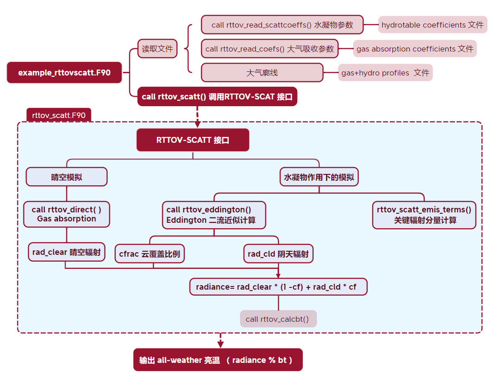
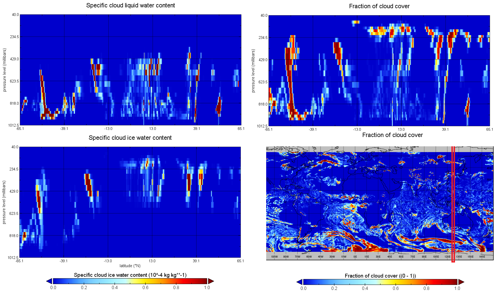
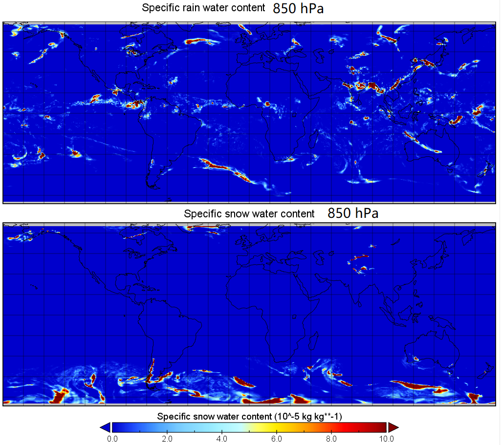
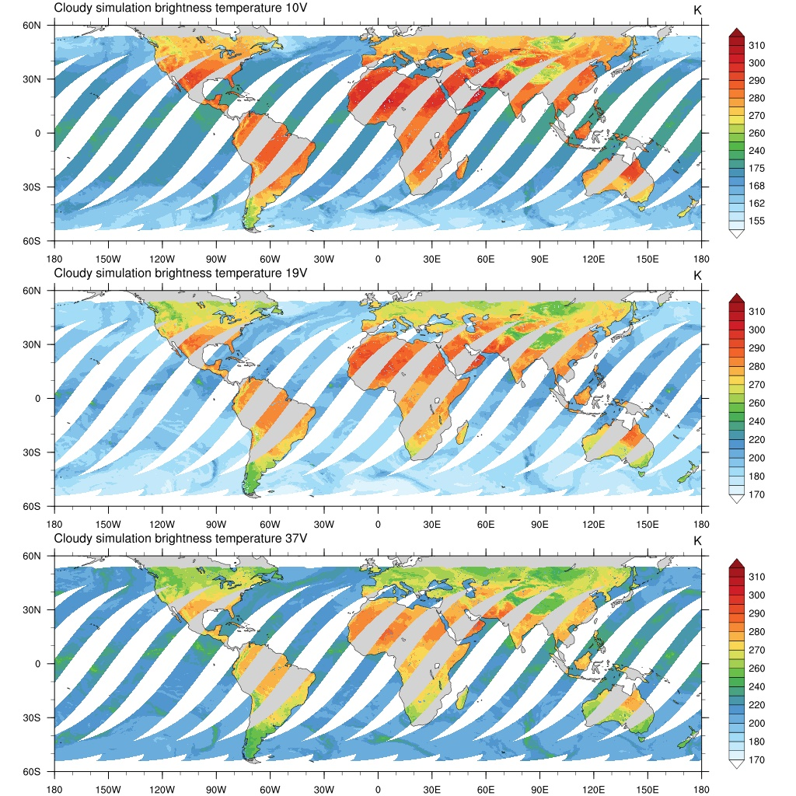
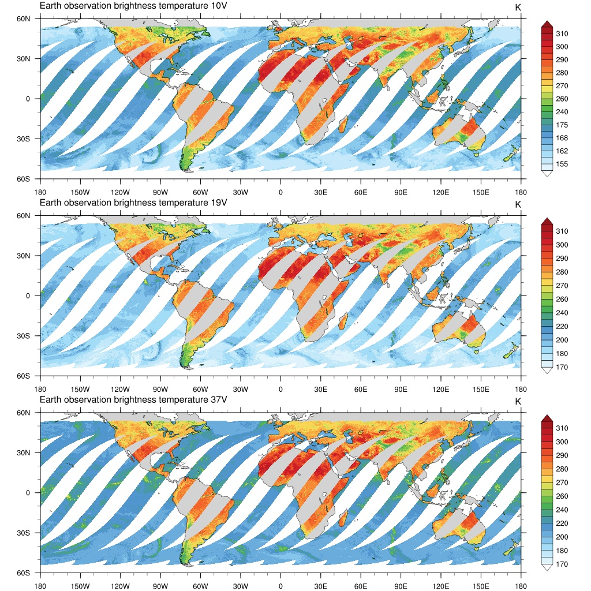
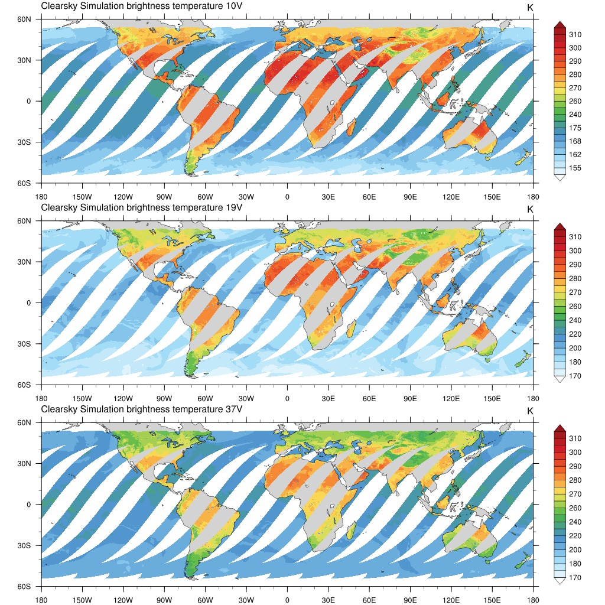
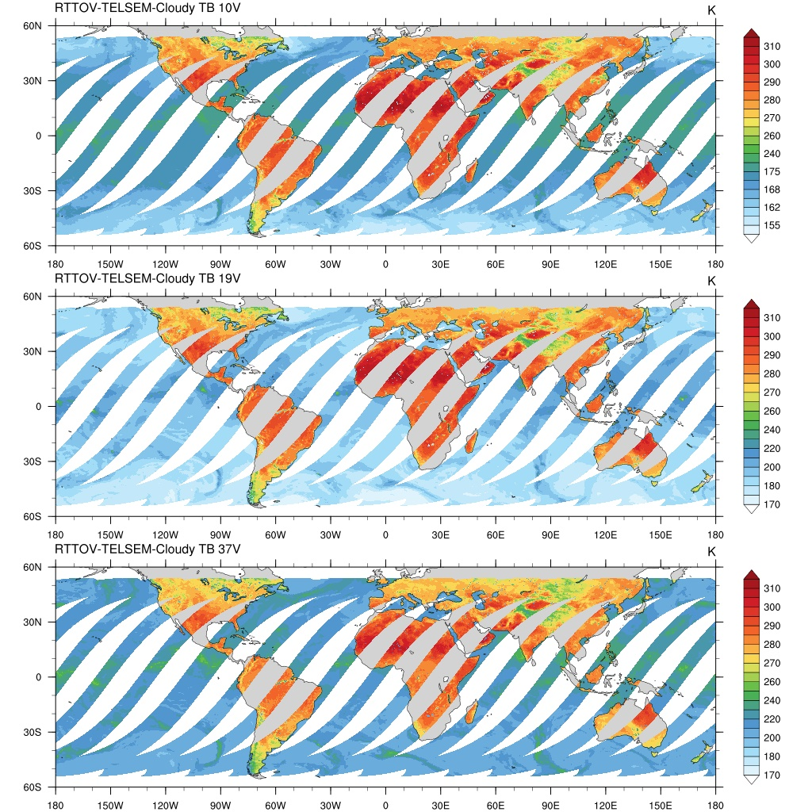

# RTTOV模式学习笔记：(六) 基于MW-SCATT的水凝物模拟

&copy;Jiheng Hu 2023-2030, 禁止转载。

本节主要介绍RTTOV MW-SCATT模块对于水凝物散射和全天气微波辐射模拟。
## MW-SCATT原理
1. 水凝物方案
根据源码和[Baordo的文献](./rttov132-mw-scat/baordo.pdf)，SCATT模块采用的方案如下：
>The observation operator designed for assimilating microwave radiances in clear, cloudy and precipitating scenes is RTTOV-SCATT (Bauer et al., 2006), which uses the delta-Eddington approximation (Joseph et al., 1976) to solve the radiative transfer equation including scattering. The bulk optical properties for cloud water, cloud ice and rain are pre-tabulated for each hydrometeor type as a function of temperature, frequency and water content. Cloud water, cloud ice and rain are modelled as spherical particles using Mie theory and a constant density: the first two hydrometeors use a gamma size distribution (e.g. Petty and Huang, 2011), while a Marshall and Palmer (1948) size distribution is used for rain.   

    总结来说，采用了：
    - 水凝物的球形粒子mie散射计算；
    - 预先计算的水凝物光学系数表；
    - 云滴谱采用gamma DSD分布；
    - 雨滴谱采用marshall-palmer分布；
    - 雪花的形状和散射采用刘国胜的方案。

2. 双模计算
MW-SCATT模块内部引用了rttov_direct()进行晴空模拟；对水凝物的散射计算使用了Hydrotable参数表来实现快速计算，采用了Eddington近似进行散射计算；


3. 亮温加权
MW-SCATT分别计算晴空气体吸收和阴天的水凝物的散射吸收，再使用云分数进行辐射的加权平均。

$$
Tb_{all sky} = (1 − CC)* Tb_{clr} + CC * Tb_{cld}   
$$

按照[Baordo的文献](baordo.pdf)介绍，CC(cloud cover)在陆地上时被赋予了所有层中最大的那层的Cmax，而在海面上，采用多种水凝物含量的多层加权Cav。
>Over ocean surfaces, C is computed as a hydrometeor-weighted average of cloud, convective and large-scale precipitation fractions across all vertical levels, providing an approximate but computationally efficient solution to account for the effects of subgrid variability in cloud and precipitation (Geer et al., 2009a,2009b, the ‘Cav’ approach).
>Over land surfaces, C is computed as the largest cloud fraction in the model profile (the ‘Cmax’ approach.) This is essentially a tuning measure to compensate for a relative lack of deep convection over land in the model, compared with over the ocean.

## 理想模拟
1. 简单个例
```fortran ideal_rttovscatt_fw.f90
prof_filename='./prof_rttovscatt.dat'
hydrotable_filename='/home/hjh/rttov13/rtcoef_rttov13/hydrotable/hydrotable_fy3_mwri.dat'
coef_filename='/home/hjh/rttov13/rtcoef_rttov13/rttov13pred54L/rtcoef_fy3_4_mwri.dat'
nprof=3
nlevels=61
nchannels=10
ALLOCATE(channel_list(nchannels))
channel_list=(/1,2,3,4,5,6,7,8,9,10/)
nthreads=1
```
一共三条廓线，存储在[prof_rttovscatt.dat](./rttov132-mw-scat/prof_rttovscatt.dat)，每条廓线都是61层，包含大气温湿度参数和四种水凝物浓度，单位是ppmv:
```fortran 
! --- Profile 1 ---
! Vertical profiles:
!       p        ph         t         q        cc       clw       ciw      rain      snow
!   [hPa]     [hPa]       [K]    [ppmv]     [0-1]   [kg/kg]   [kg/kg]   [kg/kg]   [kg/kg]
 0.498E-02 0.000E+00 0.225E+03 0.307E+01 0.000E+00 0.000E+00 0.000E+00 0.000E+00 0.000E+00
 0.100E+00 0.100E-01 0.225E+03 0.614E+01 0.000E+00 0.000E+00 0.000E+00 0.000E+00 0.000E+00
 ......省略......
 0.986E+03 0.984E+03 0.279E+03 0.823E+04 0.000E+00 0.358E-06 0.000E+00 0.168E-04 0.000E+00
 0.989E+03 0.988E+03 0.279E+03 0.831E+04 0.000E+00 0.119E-06 0.000E+00 0.165E-04 0.132E-07
! Near-surface variables:
!  2m T (K)    2m q (ppmv) 2m p (hPa) 10m wind u (m/s)  10m wind v (m/s)
   279.638    8507.6938    990.138      -2.69568             3.88115
! Skin variables:
!  Skin T (K)  Salinity   FASTEM parameters for land surfaces
   280.403     35.0       3.0 5.0 15.0 0.1 0.3
! Surface type (0=land, 1=sea, 2=sea-ice) and water type (0=fresh, 1=ocean)
   1         1
! Elevation (km), latitude and longitude (degrees)
   0.    0.   0.
! Sat. zenith and azimuth angles(degrees)
   23.     0.
```
输出[output_ideal_rttovscatt_fwd.dat](./rttov132-mw-scat/output_ideal_rttovscatt_fwd.dat)。  

2. 考虑CLW的吸收？
在晴空的条件的模拟（不考虑水凝物的散射情况下）， RTTOV可以考虑CLW的吸收效应：
>《user guide: P40》For MW simulations it is possible to supply a cloud liquid water (CLW) profile in the profiles(:)%clw(:) array which is treated as a purely absorbing medium. It is important to note that this is not the same as CLW supplied to RTTOVSCATT for scattering simulations (see section 8.7). If you wish to include CLW in the “clear-sky” simulations, you must set opts%rt_mw%clw_data to true. By default, RTTOV ignores any CLW content above 322hPa. This limit is specified in the opts%rt_mw%clw_cloud_top option allowing you to modify it if you wish.  
按照文档的说明，如果你想把云水的吸收作用考虑进行，需要将`opts%rt_mw%clw_data = .true.`，源码是默认关闭的(rttov_scatt.F90: line 376)。注意这里不同与rttov-scatt模块，只进行云水的吸收计算。   
这一选项使得RTTOV执行以下代码的片段：
```fortran rttov_direct.F90: line 676
!--------------------------------------------------------------------------
! MW CLW absorption optical depths
!--------------------------------------------------------------------------
  IF (sensor_mw .AND. opts%rt_mw%clw_data) THEN
    CALL rttov_mw_clw_absorption( &
            opts,             &
            coefs%coef,       &
            chanprof,         &
            traj0%raytracing, &
            profiles,         &
            traj0%aux_prof,   &
            traj0%opdp_path)
  ENDIF
```
但是，RTTOV-SCATT模块在进行晴空column的模拟时，默认不考虑CLW-cloud liquid water的吸收效应。这在以下的两处代码块都可以体现：
```fortran rttov_scatt.F90: line 367 和 example_fwd.F90: Line 181
  opts%rt_mw%clw_data            = .false.
  ......
  Call rttov_direct(......) 
```
rttov_scatt.F90和 example_fwd.F90的差异在于，后者时晴空的模拟示例，我们可以直接修改`clw_data= .false.`以实现对CLW吸收的考虑（实际上毫无必要）。但是前者属于RTTOV-SCATT模块的源码，对`clw_data`设置被封装在rttov_scatt高级接口中，在模式编译安装时已经生成了动态库，直接修改rttov_scatt.F90的源码将不起任何作用。修改以后必须在'src/main/'目录下执行make才能更新动态库`rttov13/obj/rttov_scatt.o`,`/lib/librttov_mw_scatt.a`。
注意！这里涉及到的改动较大，先新建rttov_scatt.F90的副本，再做探讨。
新建副本：
```bash
$ cd /home/hjh/rttov13/src/mw_scatt
$ cp rttov_scatt.F90 rttov_scatt.F90_bak
```
作为测试，修改上述代码块并添加一行打印信息：
```fortran rttov_scatt.F90: line 367 
  opts%rt_mw%clw_data            = .true. !! enable CLW as gass absorptor in SCATT module
  print*, opts%rt_mw%clw_data  !! print to screen the info
```
编译rttov_scatt模块：
```bash 
[hjh@node05] ~/rttov13/src/mw_scatt 
$make
cd ../../tmp-gfortran-openmp/mw_scatt && gfortran -I../..//include -D_RTTOV_NETCDF -I/home/hjh/netcdf/include  -D_RTTOV_HDF -I/home/hjh/hdf5/include       -fPIC -O3 -fopenmp -ffree-line-length-none -I../..//mod -c ../../src/mw_scatt/rttov_scatt.F90 -o ../..//obj/rttov_scatt.o
...省略...
ar: 正在创建 ../..//lib/librttov13_mw_scatt.a
\ln -s librttov13_mw_scatt.a ../..//lib/librttov_mw_scatt.a
```
切换到个例模拟目录，编译执行模拟程序：
```bash
$ cd /data04/1/hjh/rttov.mlse.algor/2.cloud.forward/ideal.simu.scatt
$ make -f makefile_exaple
$ ./ideal_rttovscatt_fwd.exe 
    coefficient file : /home/hjh/rttov13/rtcoef_rttov13/rttov13pred54L/rtcoef_fy3_4_mwri.dat
    hydrotable file : /home/hjh/rttov13/rtcoef_rttov13/hydrotable/hydrotable_fy3_mwri.dat
    profile file : ./prof_rttovscatt.dat
    2023/08/18  23:10:35  Open scattering coefficient file /home/hjh/rttov13/rtcoef_rttov13/hydrotable/hydrotable_fy3_mwri.dat
    T
    2023/08/18  23:10:36  fatal error in module ../../src/main/rttov_check_options.F90:0279
        Profiles structure not allocated for clw, but clw_data flag is true; opts%rt_mw%clw_data must be true when calling rttov_alloc_prof
    2023/08/18  23:10:36  fatal error in module ../../src/main/rttov_direct.F90:0257
    2023/08/18  23:10:36  fatal error in module rttov_scatt
        error in rttov_direct
    rttov_scatt error
    STOP 1
```
`T`打印出来了，说明修改生效。但是后续运行出错，报错信息很明确：在考虑CLW的同时没有将CLW廓线存放在profiles%clw结构体中，而是作为水凝物放在了`cld_profiles(iprof) % hydro(ilev,hydro_index_clw)`中，那么scatt_direct接口获取不到液态水的廓线。
```fortran rttov_check_options.F90: line 279
    IF (opts%rt_mw%clw_data) THEN
      IF (.NOT. ASSOCIATED(profiles(1)%clw)) THEN
        err = errorstatus_fatal
        msg = 'Profiles structure not allocated for clw, but clw_data flag is true; '// &
              'opts%rt_mw%clw_data must be true when calling rttov_alloc_prof'
        THROWM(err.NE.0, msg)
      ENDIF
    ENDIF
```
所以此处如果考虑CLW的吸收，还必须要给profiles%clw赋值。做两个地方的改动：
个例代码，创建profile%clw：
```fortran ideal_rttovscatt_fwd.f90: line 239
    !! 添加以下一行代码
  opts%rt_mw%clw_data=.true.  !!! jiheng to enable CLW absorption
 ! Allocate structures for RTTOV direct model
  CALL rttov_alloc_direct(......)
```
CLW廓线赋值
```fortran ideal_rttovscatt_fwd.f90: line 338
    cld_profiles(iprof) % hydro(ilev,hydro_index_snow)     ! snow (kg/kg)
    !! 添加以下一行代码
	profiles(iprof) % clw(ilev)= cld_profiles(iprof) % hydro(ilev,hydro_index_clw)  !!!  jiheng to enable CLW absorption
    ! graupel (kg/kg) (not in data file)
    cld_profiles(iprof) % hydro(ilev,hydro_index_graupel) = 0.0_jprb
```
修改rttov_scatt.F90源码：
```fortran  rttov_scatt.F90: line 376
  ! opts%rt_mw%clw_data            = .false.
  opts%rt_mw%clw_data            = .true.  !! jiheng to enable CLW absorption
```
重复以上编译运行过程，发现运行成功，输出为[output_ideal_rttovscatt_fwd-clw.dat](./rttov132-mw-scat/output_ideal_rttovscatt_fwd-clw.dat)。
大气廓线多了一类CLW，模拟的亮温和先前也有所增加：
```
考虑CLW吸收前：
 122.978 109.550 145.061 132.054 168.257 156.747 183.278 171.656 239.429 232.793
考虑CLW吸收后：
 125.531 112.312 151.449 139.065 176.342 165.698 197.658 187.871 254.956 251.438
```
这是因为云液态水对低频微波的影响主要是吸收作用，为什么SCATT模块默认不考虑CLW吸收呢？那为什么留下opts%rt_mw%clw_data选项而不用呢？
我自己的认识：晴空模拟部分不需要考虑云水的吸收，因为是按照云盖分开的，所以是存粹的清空模拟；有云部分的云水散射和吸收（和为消光）由Eddington近似完成。如果再将CLW的吸收考虑进去，那么会多计算一次云水的吸收，结果自然偏大；
所以，opts%rt_mw%clw_data是用于无散射云水的模拟。所以针对这个的探讨导致为止，将代码回复到默认样式。建议不要修改任何默认配置。

## Eddington近似
源码看的十分费劲，所以推荐刊廖国男的《大气辐射导论》教程。

## 云水的敏感性研究
也略...

## FY3G MWRI个例模拟
继续使用ERA5的大气廓线和水凝物廓线：
- 云水、云冰和云分数如下：

- 雨水和雪水：


由于ERA5廓线在地形（如高原）以下的部分也是有效值，是地表层的填充。在输入RTTOV之前，我对水凝物廓线做了如下修正：
```fortran
	where(profiles(iprof)%p(:)>profiles(iprof)%s2m%p)profiles(iprof)%q=1.E-9
	where(profiles(iprof)%p(:)>profiles(iprof)%s2m%p)cld_profiles(iprof)%hydro_frac(:,1)=0.0
	where(profiles(iprof)%p(:)>profiles(iprof)%s2m%p)cld_profiles(iprof)%hydro(:,hydro_index_clw)=0.0
	where(profiles(iprof)%p(:)>profiles(iprof)%s2m%p)cld_profiles(iprof)%hydro(:,hydro_index_ciw)=0.0
	where(profiles(iprof)%p(:)>profiles(iprof)%s2m%p)cld_profiles(iprof)%hydro(:,hydro_index_rain)=0.0
	where(profiles(iprof)%p(:)>profiles(iprof)%s2m%p)cld_profiles(iprof)%hydro(:,hydro_index_snow)=0.0
```
为了逃逸输入检查，将`opts_scatt%config%do_checkinput= .FALSE.`

### 亮温模拟结果

考虑水凝物散射的模拟结果：

卫星实时观测：

上一章中晴空假设的模拟结果：


## 使用Emissivity Atlas的模拟
同上一章一样，我们使用TELSEM2的atlas替换模式内部的emiss方案。模拟的结果如下：
使用TELSEM作为陆面发射率的all-weather模拟：


完整的运行日志如下[screen-rttoc-scatt-telsem2.log](./rttov132-mw-scat/screen-rttoc-scatt-telsem2.log)


