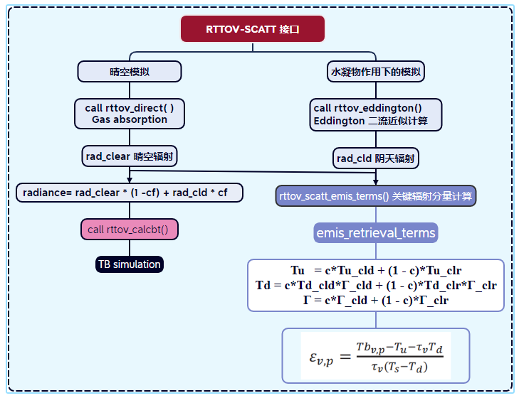
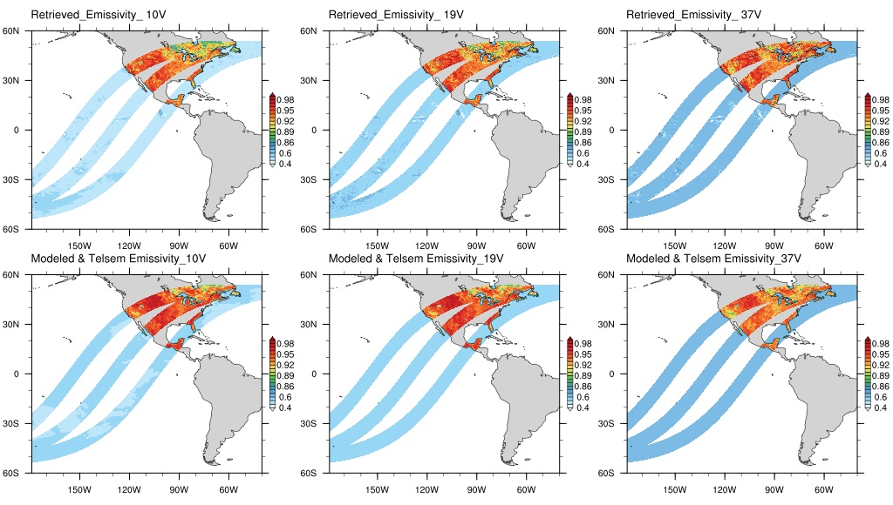

# RTTOV模式笔记：(七) 全天气地表微波比辐射反演方案

&copy;Jiheng Hu 2023-2030, 禁止转载。


本节将介绍RTTOV-SCATT模块内置的动态发射率反演的使用。这一部分源码中没有直接的example，但是文档和源码中已经提供了必备的接口，我们要做的就是把这些接口组合起来，实现反演流程。

## 反演流程的构建
1. 流程框架


2. 源码细节
- 引入必要的变量类型
```fortran
  USE rttov_types, ONLY :     &
        ......
		rttov_scatt_emis_retrieval_type
```
- 引用必要的接口
```fortran
  include "rttov_alloc_emis_ret_terms.interface"
  # include "rttov_scatt_emis_terms.interface"  !! 实际上在rttov_scatt.F90内部引用使用，此处不需要引用
  include "rttov_scatt_emis_retrieval.interface"
```
- 声明变量
```fortran
 Type(rttov_scatt_emis_retrieval_type) :: emis_retrieval_terms  ! radiance terms for emissivity retrieve
  INTEGER(KIND=jpim) 			:: err_alloc
  INTEGER(KIND=jpim)		    :: asw
  REAL(kind=jprb), ALLOCATABLE  :: obs_tb (:)     ! Observed TB 
  REAL(kind=jprb), ALLOCATABLE  :: land_emis (:)  ! Retrieved emissivity
```
- 分配变量
```fortran
  ! --------------------------------------------------------------------------
  ! 3. Allocate RTTOV input and output structures
  ! --------------------------------------------------------------------------
  nchanprof = nchannels * nprof
 
  ALLOCATE(obs_tb(nchanprof))
  ALLOCATE(land_emis(nchanprof))
  obs_tb= (/122.978, 109.550, 145.061, 132.054, 168.257, 156.747, 183.278, 171.656, 239.429, 232.793, &
			124.568, 111.924, 147.515, 135.568, 170.754, 160.350, 188.391, 178.397, 243.950, 239.090, &
			119.652, 106.068, 136.334, 122.598, 154.660, 141.782, 164.872, 150.992, 213.784, 201.940/)

  !! Allocate emis_retrieval_terms
  !! @param[out]    err                     status on exit
  !! @param[in]     nchanprof               size of the chanprof array (total number of channels being simulated)
  !! @param[in,out] emis_retrieval_terms    emissivity retrieval terms structure to allocate/deallocate
  !! @param[in]     asw                     1_jpim => allocate; 0_jpim => deallocate
  Call rttov_alloc_emis_ret_terms(err_alloc, nchanprof, emis_retrieval_terms, 1_jpim)
  IF (err_alloc /= errorstatus_success) THEN
	WRITE(*,*) 'allocation error for emis_retrieval_terms structures'
	CALL rttov_exit(errorstatus)
  ENDIF
```
- 调用rttov_scatt，输入可选参数emis_retrieval_terms
```fortran
CALL rttov_scatt ( &
    errorstatus,         &! out   error flag
    ......
    radiance,            &! inout computed radiances
    emis_retrieval_terms=emis_retrieval_terms)  
```
- 调用反演接口
```fortran
  ! --------------------------------------------------------------------------
  ! 8. Call Emssivity retrieval interface
  ! --------------------------------------------------------------------------
  !! @param[in]     chanprof      channels and profiles simulated by RTTOV-SCATT
  !! @param[in]     coefs         RTTOV coefficients structure
  !! @param[in]     emis_terms    output radiances and corresponding BTs
  !! @param[in]     obs_tb        observed BTs corresponding to simulated BTs
  !! @param[out]    land_emis     output retrieved emissivities
  call rttov_scatt_emis_retrieval(&
								  chanprof,             &
								  coefs,                &
								  emis_retrieval_terms, &
								  obs_tb,               &
								  land_emis)

```
- 输出
```fortrab
  DO iprof = 1, nprof
    joff = (iprof-1_jpim) * nchannels
    WRITE(ioout,*)' '
    WRITE(ioout,*)'Observed TBs:'
    WRITE(ioout,444) (obs_tb(j), j = 1+joff, nchannels+joff)
    WRITE(ioout,*)'Retrieved SURFACE EMISSIVITIES:'
    WRITE(ioout,444) (land_emis(j), j = 1+joff, nchannels+joff)
  ENDDO
```

- 释放结构体
```fortran
  Call rttov_alloc_emis_ret_terms(err_alloc, nchanprof, emis_retrieval_terms, 0_jpim)
  IF (err_alloc /= errorstatus_success) THEN
	WRITE(*,*) 'deallocation error for emis_retrieval_terms structures'
	CALL rttov_exit(errorstatus)
  ENDIF
  deallocate(obs_tb)
  deallocate(land_emis)
```
## 理想个例模拟
如上一章的理想模拟所诉，我们进行了三条廓线，十个通道的模拟，结果如下：
```ascii output_ideal_rttovscatt_retri.dat
廓线一：
 CALCULATED BRIGHTNESS TEMPERATURES (K):
  122.978 109.550 145.061 132.054 168.257 156.747 183.278 171.656 239.429 232.793
 CALCULATED SURFACE EMISSIVITIES:
    0.408   0.358   0.444   0.391   0.467   0.413   0.520   0.461   0.660   0.597

 Observed TBs:
  122.978 109.550 145.061 132.054 168.257 156.747 183.278 171.656 239.429 232.793
 Retrieved SURFACE EMISSIVITIES:
    0.409   0.359   0.447   0.394   0.473   0.419   0.527   0.469   0.668   0.606
---------------------------------------------------------------------------------
廓线二：
 CALCULATED BRIGHTNESS TEMPERATURES (K):
  124.568 111.924 147.515 135.568 170.754 160.350 188.391 178.397 243.950 239.090
 CALCULATED SURFACE EMISSIVITIES:
    0.411   0.364   0.448   0.398   0.471   0.420   0.523   0.470   0.663   0.606

 Observed TBs:
  124.568 111.924 147.515 135.568 170.754 160.350 188.391 178.397 243.950 239.090
 Retrieved SURFACE EMISSIVITIES:
    0.413   0.365   0.453   0.403   0.480   0.430   0.535   0.483   0.677   0.624
-----------------------------------------------------------------------------------
廓线三：
 CALCULATED BRIGHTNESS TEMPERATURES (K):
  119.652 106.068 136.334 122.598 154.660 141.782 164.872 150.992 213.784 201.940
 CALCULATED SURFACE EMISSIVITIES:
    0.407   0.358   0.445   0.392   0.468   0.414   0.522   0.463   0.662   0.599
   
 Observed TBs:
  119.652 106.068 136.334 122.598 154.660 141.782 164.872 150.992 213.784 201.940
 Retrieved SURFACE EMISSIVITIES:
    0.408   0.358   0.447   0.393   0.472   0.417   0.525   0.467   0.667   0.604
```
可以看出，我们将正向模拟的TB当作观测输入，成功地反演出来了surface emissivity, 这几个都是洋面样本。

## 敏感性
对emissivity%emis_in进行控制，检查敏感性。
``` fortran sensivitive_to_mlseinit.f90
!! enable self-specified MLSE
calcemis(:)= .false.

!!! controls
do iprof=1,nprof
	joff = (iprof-1_jpim) * nchannels
	emissivity(1+joff: nchannels+joff)% emis_in = 0.7 + iprof*0.002	
	obs_tb(1+joff: nchannels+joff)= (/ 253.503, 253.503, 256.027, 256.023, 259.301, 259.296, 259.640, 259.634 ,264.946, 264.809/)
end do
```
```
  Profile            1
 Specified SURFACE EMISSIVITIES:
    0.702   0.702   0.702   0.702   0.702   0.702   0.702   0.702   0.702   0.702
 CALCULATED BRIGHTNESS TEMPERATURES (K):
  202.148 202.150 211.126 211.124 223.599 223.596 225.980 225.982 250.287 250.164
 Observed TBs:
  253.503 253.503 256.027 256.023 259.301 259.296 259.640 259.634 264.946 264.809
 Retrieved SURFACE EMISSIVITIES:
    0.900   0.900   0.900   0.900   0.900   0.900   0.900   0.900   0.901   0.901
  
  Profile            2
 Specified SURFACE EMISSIVITIES:
    0.704   0.704   0.704   0.704   0.704   0.704   0.704   0.704   0.704   0.704
 CALCULATED BRIGHTNESS TEMPERATURES (K):
  202.667 202.668 211.580 211.578 223.960 223.956 226.320 226.322 250.435 250.312
 Observed TBs:
  253.503 253.503 256.027 256.023 259.301 259.296 259.640 259.634 264.946 264.809
 Retrieved SURFACE EMISSIVITIES:
    0.900   0.900   0.900   0.900   0.900   0.900   0.900   0.900   0.901   0.901
```

结果表明，初始设定的emissivity不会影响MLSE的反演。完整的输出结果：[output_sensivitive_to_mlseini.dat](./rttov132-mw-scat/output_sensivitive_to_mlseini.dat)


## 个例模拟
如上一章的个例，采用TELSEM2作为初始输入，考虑水凝物的RTTOV-SACTT模拟，同时嵌入本章所述的反演方案：
结果如下：

