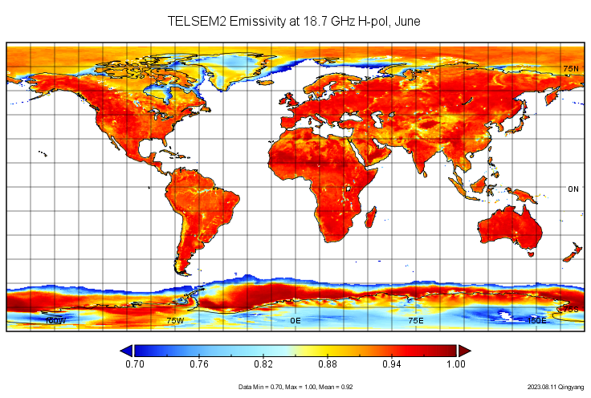

# TELSEM Emissivity Atlas的离线使用
&copy;Jiheng Hu 2023-2030, 禁止转载。

## Intro
在Direct Forward的晴空模拟的章节，我们介绍过使用TELSEM2 Atlas进行RTTOV模拟，这里单开一节对这个数据集的离线使用进行介绍。
TELSEM 由CNRS的F.Aires和C. Priegent 在[《A Tool to Estimate Land-Surface Emissivities at Microwave frequencies (TELSEM) for use in numerical weather prediction》](#References) 中提出。TELSEM基于SSM/I地表发射率数据集([C. Prigent, 1997](#References))的19V&H, 22V, 37V&H, 85V&H等通道的Emissivity进行频率插值，得到月平均的，具有一定空间分辨率的（或固定经纬度）的全球陆面微波发射率，其适用频段为10 – 700 GHz.
本节只介绍单独使用TELSEM进行气候态地表发射率估算的方法，不会涉及如何在RTTOV的模拟中使用TEMSEM。

## 下载TELSEM2 Atlas
下载页：https://nwp-saf.eumetsat.int/site/software/rttov/download/#Emissivity_BRDF_atlas_data
下载telsem2_mw_atlas.tar.bz2解压在`/home/hjh/rttov13/emis_data/`目录下：
```bash
$ cd /home/hjh/rttov13/emis_data
$ tar -xvf telsem2_mw_atlas.tar.bz2
├── ssmi_mean_emis_climato_01_cov_interpol_M2
├── ssmi_mean_emis_climato_02_cov_interpol_M2
├── ssmi_mean_emis_climato_03_cov_interpol_M2
├── ssmi_mean_emis_climato_04_cov_interpol_M2
├── ssmi_mean_emis_climato_05_cov_interpol_M2
├── ssmi_mean_emis_climato_06_cov_interpol_M2
├── ssmi_mean_emis_climato_07_cov_interpol_M2
├── ssmi_mean_emis_climato_08_cov_interpol_M2
├── ssmi_mean_emis_climato_09_cov_interpol_M2
├── ssmi_mean_emis_climato_10_cov_interpol_M2
├── ssmi_mean_emis_climato_11_cov_interpol_M2
├── ssmi_mean_emis_climato_12_cov_interpol_M2
├── telsem2
│   ├── Makefile
│   ├── mod_mwatlas_m2.F90
│   ├── README_TELSEM2.pdf
│   ├── readme.txt
│   └── test_telsem2.F90
└── correlations
```
telsem包含了ASCII方式存储的Atlas和独立的Fortran读取代码，可以在别的地方使用。RTTOV内置了针对TELSEM2的发射率地图和相应的插值工具的支持。

## 离线使用Atlas
`mod_mwatlas_m2.F90`提供了使用telsem的接口，`test_telsem2.F90`提供了示例脚本：
较为核心的设定包括，经纬度，频率，月份和分辨率
```fortran
  resol    = 0.25
  theta    = 15.

  lat      = -30.
  lon      = 302.
  freq     = 30.                          ! For single frequency experiment
  freq2(:) = (/30., 25., 38., 60., 90. /) ! For multiple frequency experiment
  i        = 1                            ! Index of freq in freq2 array
```

运行如下：

```shell
[hjh@node05] ~/rttov13/emis_data/telsem2 $ make -f Makefile 
[hjh@node05] ~/rttov13/emis_data/telsem2 $ ./test_telsem2 
```
stdout>>
```
Reading atlas for month   9
Reading number of data in atlas...
Nb data=    233959
reading classes...
 
Inputs:
lat   =   -30.00
lon   =   302.00
theta =    15.00
freq  =    30.00
 
The first four sets of output are identical:
 
Single freq, no spatial averaging
Emis V-pol, H-pol   =   0.954829  0.954446
Stddev V-pol, H-pol =   0.020591  0.021068
Covariance V-/H-pol =   0.000372
 
Multiple freq, no spatial averaging
Emis V-pol, H-pol   =   0.954829  0.954446
Stddev V-pol, H-pol =   0.020591  0.021068
Covariance V-/H-pol =   0.000372
 
Single freq, with spatial averaging, native resol.
Emis V-pol, H-pol   =   0.954829  0.954446
Stddev V-pol, H-pol =   0.020591  0.021068
Covariance V-/H-pol =   0.000372
 
Multiple freq, with spatial averaging, native resol.
Emis V-pol, H-pol   =   0.954829  0.954446
Stddev V-pol, H-pol =   0.020591  0.021068
Covariance V-/H-pol =   0.000372
 
Now the spatial averaging is active and results are different to those above:
 
Single freq, with spatial averaging, non-native resol.
Emis V-pol, H-pol   =   0.952811  0.952665
Stddev V-pol, H-pol =   0.020790  0.023314
Covariance V-/H-pol =   0.000406
 
Multiple freq, with spatial averaging, non-native resol.
Emis V-pol, H-pol   =   0.952811  0.952665
Stddev V-pol, H-pol =   0.020790  0.023314
Covariance V-/H-pol =   0.000406
 
 
Now only return emissivities and print them for all frequencies:
 
Multiple freq, with spatial averaging, non-native resol.
Freq (GHz) :     30.000    25.000    38.000    60.000    90.000
Emis V-pol =   0.952811  0.954156  0.951043  0.953123  0.955559
Emis H-pol =   0.952665  0.954065  0.950784  0.952975  0.955488
```


## Global 0.25° MLSE
按照示例脚本，我们可以对经纬度进行循环，制作全球格点平均的地表发射率产品。
这里分享一下清扬师弟写的脚本，直接输出ascii文件，对于没有安装NETCDF和HDF扩展的同学比较实用友好：

```fortran
PROGRAM globe_mlse_telsem
! call TELSEM2 atlas and interpolator to generate global 0.25 degree land surface emissivity on monthly basis
! By Qingyang Liu, Aug, 2023, USTC
! adapted from test_telsem.F90

  USE mod_mwatlas_m2

  IMPLICIT NONE
  INTEGER       :: m,n
  CHARACTER(len=130) fout
  CHARACTER(len=2) mm

  INTEGER(jpim) :: error_status

  LOGICAL(jplm) :: verbose   ! For atlas reading subroutine
  INTEGER(jpim) :: verb      !=1 for TRUE and 0 for FALSE - for emissivity routines

  INTEGER(jpim) :: month     ! (1->12)
  CHARACTER(LEN=256) :: dir  ! directory of emis database

  REAL(jprb)    :: resol     ! horizontal resolution for the user
  REAL(jprb)    :: lat       ! (-90->90)
  REAL(jprb)    :: lon       ! (0->360)
  REAL(jprb)    :: theta     ! (0->60�)

  ! For individual freq interpolations
  REAL(jprb)    :: ev, eh, stdv, stdh, covvh
  REAL(jprb)    :: freq      ! (19->85GHz)
  INTEGER(jpim) :: i

  ! For multiple freq interpolations
  INTEGER(jpim), PARAMETER :: nchan = 5
  REAL(jprb)    :: ev2(nchan), eh2(nchan), std(2*nchan,2*nchan)
  REAL(jprb)    :: freq2(nchan)

  ! Structure containing atlas data
  TYPE(telsem2_atlas_data) :: atlas
  !--- End of header ----------------------------------
  verbose = .TRUE.  ! Verbose output for reading subroutine
  verb = 0          ! No verbose output for emissivity subroutines
  !====================================================
  ! Read the atlas
  !====================================================
  dir = '../'
  month = 6 !! modify or do loop to simulate other months

  ! WRITE(0,'(a,i3)') 'Reading atlas for month ',month
  CALL rttov_readmw_atlas(TRIM(dir), month, atlas, verbose, error_status)
  IF (error_status /= 0) THEN
    WRITE(0,'(a)') 'Error reading atlas'
    STOP 1
  ENDIF

  !====================================================
  ! Calculate emissivities
  !====================================================
  ! Multiple frequencies, spatially averaged, return emissivities only
  write(mm,"%0.2i") month !!  to the form '06'
!   yue = (/"01","02","03","04","05","06","07","08","09","10","11","12"/)
  fout     ='SSMI'//mm//'.txt'
  resol    = 0.25
  theta    = 53.1
  freq     = 10.65
  freq2(:) = (/10.65, 18.7, 23.8, 36.5, 89.0/) ! For multiple frequency experiment
  i        = 0                          ! Index of freq in freq2 array

  open(15,file= trim(adjustl(fout)))       !!final product
  lat      = -90.
  do m     = 1,720
    lon  = 0.
    do n = 1,1440
      CALL emis_interp_int_mult(lat, lon, resol, theta, freq2, nchan, atlas, ev2, eh2, verb = verb)
      WRITE(15,100) lat,lon,(ev2(i),i=1,5),(eh2(i),i=1,5)
      lon = lon+0.25
    end do
    lat = lat+0.25
    print*, m
  end do

 CLOSE(15)
100 FORMAT(12(1x,f14.6))

  !====================================================
  ! Close the atlas
  !====================================================
  CALL rttov_closemw_atlas(atlas)

END PROGRAM globe_mlse_telsem
```
使用其他语言转换成NC文件，或者直接绘图：
TELSEM2 6月份地表发射率估算：


## References
1. Aires, F., Prigent, C., Bernardo, F., Jiménez, C., Saunders, R. and Brunel, P. (2011), A Tool to Estimate Land-Surface Emissivities at Microwave frequencies (TELSEM) for use in numerical weather prediction. Q.J.R. Meteorol. Soc., 137: 690-699. https://doi.org/10.1002/qj.803.
2. Prigent, C., Rossow, W. B., and Matthews, E. (1997), Microwave land surface emissivities estimated from SSM/I observations, J. Geophys. Res., 102(D18), 21867–21890. https://doi.org/10.1029/97JD01360.